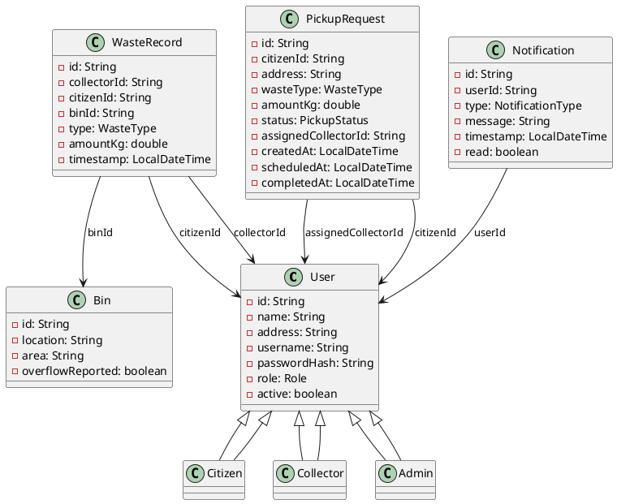

## Smart Waste Management & Recycling Tracker - Design

### Class Diagram (high-level)

- **User (abstract)**
  - fields: id, name, address, username, passwordHash, role, active
  - subclasses: **Citizen**, **Collector**, **Admin**
- **Bin**: id, location, area, overflowReported
- **PickupRequest**: id, citizenId, address, wasteType, amountKg, status, assignedCollectorId, createdAt, scheduledAt, completedAt
- **WasteRecord**: id, collectorId, citizenId?, binId?, type, amountKg, timestamp
- **Notification**: id, userId, type, message, timestamp, read

- Enums: **Role**, **WasteType**, **PickupStatus**, **NotificationType**

- Repositories: `Repository<T>`, `InMemoryRepository<T>`, `PersistentRepository<T>` (uses `FileDatabase` with Java serialization)
- Services: **AuthService**, **UserService**, **BinService**, **WasteService**, **CollectionService**, **NotificationService**, **ReportService**
- Utility: **IdGenerator**, **PasswordHasher**, **WasteClassifier**, **DataSeeder**, **ServiceRegistry**
- App: **MainCLI**, **App**

### Relationships
- `User` is inherited by `Citizen`, `Collector`, `Admin` (inheritance)
- `PickupRequest` references `Citizen` and assigned `Collector` by id (composition/association)
- `WasteRecord` references `Collector`, optional `Citizen` or `Bin`
- `Notification` references a `User`
- `PersistentRepository` composes `FileDatabase` to persist maps of entities

### Sequence Diagram (pickup workflow)

1. Citizen logs in -> `AuthService.login`
2. Citizen requests pickup -> `CollectionService.createPickupRequest`
   - Creates `PickupRequest`
   - Auto-assigns first available `Collector`
   - Schedules next-day 9AM
   - Saves to repository
3. Collector views assigned pickups -> `CollectionService.getAssignedPickups`
4. Collector completes pickup -> `CollectionService.completePickup`
   - Marks request COMPLETED, stamps time
   - Creates `WasteRecord`
   - Sends `Notification` to citizen
5. Citizen views notifications -> `NotificationService.getNotifications`
6. Admin generates reports -> `ReportService.*`

Note: For a UML-ready diagram, paste the following PlantUML into any renderer.

